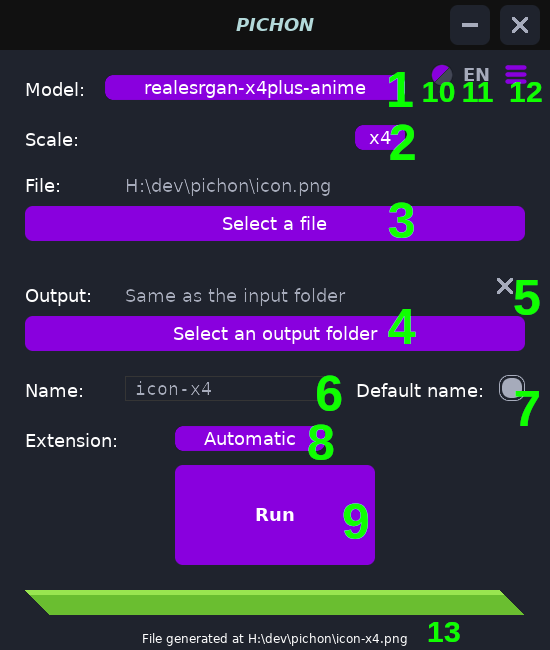

# Pichon

Simple UI tool for Real-ESRGAN.

This application require the program https://github.com/xinntao/Real-ESRGAN (download the portable executable files (NCNN)).

## How to use

1. Select the active transformation model
2. Change the scale (x2 up to x4)
3. Select the source file to upscale
4. Select to where you want the generated file to be (By default, it is the same as the source file)
5. Fall back to the default output folder
6. Name of the generated file (locked if `Default name` is toggled on)
7. Toggle the default name for the generated file
8. Setup the extension of the generated file
9. Execute the program (ESRGAN)
10. Switch the theme of the application (cosmetic)
11. Switch the language of the application
12. Specify the program to use (ESRGAN)
13. Log information

The application will need to know the path to the program (ESRGAN), you can specify it with **(12)**.
If the run button **(9)** is greyed out, it can either mean that no source file **(3)** was specified, no output file name **(6)** is specified or that the program ESRGAN is not specified **(12)**.

You can always directly modify the `config.json` file that is generated next to the application.

If no model shows up in the drop down list **(1)**, verify that a `models` folder exists next to the ESRGAN program, if not, or if the folder is different, change the `models` path inside the `config.json` file.

## Why this name ?
`Pichon` is occitan (a family of local languages in southern france) for `small`, this name is pronounced \\pitʃu\\.
